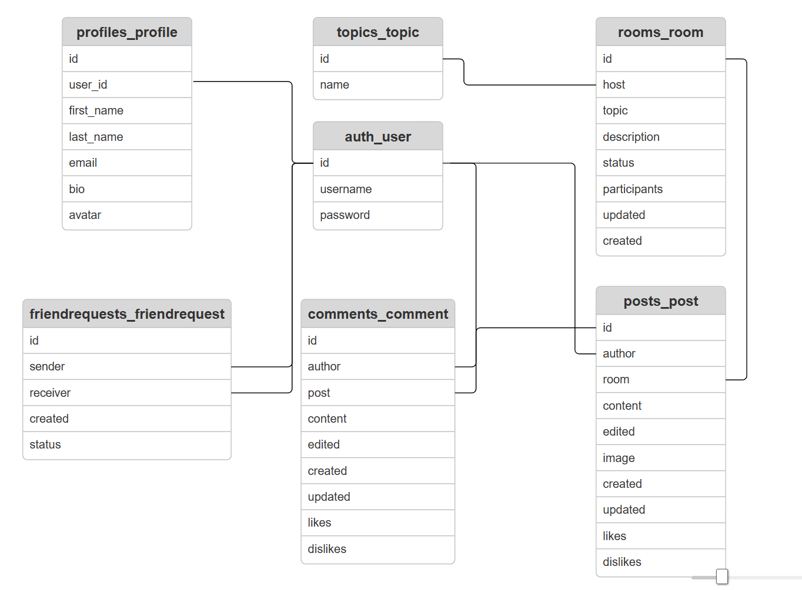

# chatPost Social Network


## About

The live website can be accessed by visiting this [link](https://chatPost.onrender.com).

This web application is a social network for groups of individuals who wish to share their knowledge and experiences. As admin you can choose the topics to set the discussions are expected. The app can be adjusted for family, friends, students or any other groups that wish to stay connected. The platform enables users to engage with each other by creating rooms, posts, commenting, and reacting to the content shared by others. By becoming friends you can restrict or allow access to your rooms.

## User Experience Design

### Strategy
The purpose of this application is to facilitate smooth and enjoyable communication. It is designed to enhance the user experience and encourage users to spend more time on the site.

### Target Audience
People who find the complexity of modern social media apps overwhelming and prefer a straightforward and user-friendly interface.

### User Stories

#### First Time Visitor Goals
- As a First Time Visitor, I want to quickly grasp the primary function of the app, so that I'm able to explore its features and learn more about it.
- As a First Time Visitor, I want an intuitive interface that, so that I can effortlessly navigate through the app and locate the presented content.
- As a First Time Visitor, I want the ability to create an account, so that I can unlock the app's full potential and allow me to experience its benefits as a user.
- As a First Time Visitor, I expect the app to be user-friendly and useful, so that I can cater my needs and preferences.

#### Frequent Visitor Goals
- As a Frequent User, I want to be able to log into my account, so that I can access my personalized content.
- As a Frequent User, I want to be able to easily navigate through the app, so that I can find the content without additional efforts.
- As a Frequent User, I want to be able to easily log in and log out, so that I can access my personal account information.
- As a Frequent User, I want to be able to update my personal data, so that I can keep my account up to date.
- As a Frequent User, I want to be able to update my avatar, so that I can keep my avatar up to date.
- As a Frequent User, I want to be able to add friends, so that I can communicate with my friends.
- As a Frequent User, I want to be able to delete friends, so that I can feel safe in this social network.
- As a Frequent User, I want to be able to easily navigate through the app, so that I can find the content without additional efforts.
- As a Frequent User, I want to be able to easily log in and log out, so that I can access my personal account information.
- As a Frequent User, I want to be able to update my personal data, so that I can keep my account up to date.
- As a Frequent User, I want to be able to update my avatar, so that I can keep my avatar up to date.
- As a Frequent User, I want to be able to add friends, so that I can communicate with my friends.
- As a Frequent User, I want to be able to delete friends, so that I can feel safe in this social network.
- As a Frequent User, I want to be able to search through the users of the social network, so that I can find people who I am interested in.
- As a Frequent User, I want to be able to search people by their names, so that I can find people who I know.
- As a Frequent User, I want to be able to create my own discussion rooms, so that I can create the conversations that I want.
- As a Frequent User, I want to be able to browse other discussion rooms, so that I can participate in the conversations that I want.
- As a Frequent User, I want to be able to delete the discussion rooms that I created, so that I can remove my community from the app.
- As a Frequent User, I want to be able to add a new post on my page or my friends' pages, so that I can share my knowledge and experiences with others.
- As a Frequent User, I want to be able to add a new comment on my post, so that I can share my knowledge and experiences with others.
- As a Frequent User, I want to be able to add a new comment to other people's post, so that I can share my knowledge and experiences with others.
- As a Frequent User, I want to be able to react to my post, so that I can share my knowledge and experiences with others.
- As a Frequent User, I want to be able to react to other people's post, so that I can share my knowledge and experiences with others.
- As a Frequent User, I want to be able to be able to edit/delete my posts, so that I can change my knowledge and experiences.
- As a Frequent User, I want to be able to share my experiences with other users, so that I can share my knowledge and experiences with others.

## Technologies used
- ### Languages:
    + [Python](https://www.python.org/downloads/release/python-385/): the primary language used to develop the server-side of the website.
    + [JS](https://www.javascript.com/): the primary language used to develop interactive components of the website.
    + [HTML](https://developer.mozilla.org/en-US/docs/Web/HTML): the markup language used to create the website.      
    + [Bootstrap](https://getbootstrap.com/): bootstrap was used to manage responsivenes and facilitate ux standardization
    + [CSS](https://developer.mozilla.org/en-US/docs/Web/css): the styling language used to style the website.
- ### Frameworks and libraries:
    + [Django](https://www.djangoproject.com/): python framework used to create all the backend logic of the website.

- ### Databases:
    + [SQLite](https://www.sqlite.org/): was used as a database during the development stage of the website.
    + [PostgreSQL](https://www.postgresql.org/): the database used to store all the data.
- ### Other tools:
    + [Balsamiq](https://balsamiq.com/): was used to create wireframes
    + [Github Projects and kanban boards](https://github.com/lexach91/Django-social-network-PP4/projects) was used to track the progress of the project in general and of every application in the project.
    + [Git](https://git-scm.com/): the version control system used to manage the code.
    + [Pip3](https://pypi.org/project/pip/): the package manager used to install the dependencies.
    + [ElephantSQL](https://www.elephantsql.com/docs/index.html): the webserver used to run the website.
    + [Cloudinary](https://cloudinary.com/): the image hosting service used to upload images and other media.
    + [Psycopg2](https://www.python.org/dev/peps/pep-0249/): the database driver used to connect to the database.
    + [Django-allauth](https://django-allauth.readthedocs.io/en/latest/): the authentication library used to create the user accounts.
    + [Render](https://render.com/): the hosting service used to deploy the website.
    + [GitHub](https://github.com/): used to host the website's source code.
    + [VSCode](https://code.visualstudio.com/): the IDE used to develop the website.
    + [Chrome DevTools](https://developer.chrome.com/docs/devtools/open/): was used to debug the website.
    + [Bootstrap](https://bootstrap.com/): Was Used to style the html elements.
    + [W3C Validator](https://validator.w3.org/): was used to validate HTML5 code for the website.
    + [W3C CSS validator](https://jigsaw.w3.org/css-validator/): was used to validate CSS code for the website.
    + [JShint](https://jshint.com/): was used to validate JS code for the website.
    + [PEP8](https://pep8.org/): was used to validate Python code for the website.


## Features


**Log in Page**


When the user is logged out, the website will redirect the home page and display the login view with Username and password fields Clicking the sign up link will display the Sign Up Page.


**Sign Up Page**

Sign up page has a box for the user to enter their username, password and password confirmation. After the user clicks the sign up button.


**Home Page/Logged in User**

When the user enters the correct username/email and password succes message will be displayed and redirects to home page. Home Page contains a search bar that allows users to filter the rooms list by, host, name and topic followed by a number of available rooms counter (which changes with the filter used in search bar) and the list of rooms whith room-details. 

- Host
- Room Name
- Access: Public/Friendsonly
- Topic
- Number of Posts
- Edit/Delete buttons: If User is Room Host


**Navbar/Sidebar**

Navbar/Navbar Tablet/Navbar Mobile


Navbar is located on the left side of the screen and has the following buttons. For the mobile and Tablet versions, the navbar will be also on the left side of the screen but will show only icons.:

- Logo and Home button, leads to the home.html page showing all rooms.

- Topics button, which will drop down a menu containing the topics chosen by the admin.

- Your Rooms button, which will drop down a list of the rooms hosted by logged in user.

- Friends button, which leads to the Friends list page.

- Profile button, which will expand a menu with Logout, Manage Profile or View Profile.


**Manage Profile Page**
This page has a main container with the input choices of the profile details. Allows the user to share their profile with friends.
- Avatar
- Bio
- First Name
- Last Name
- Email
- Save Button


**Profile Page**
This page has a main container in which the user can see their profile information.


**Friends List Page**
This page displays the following features:
- Search User Bar - allows logged in user to search all registered users by Username
- Number of friends counter
- List of friends
    - Avatar
    - View profile button
    - Remove friend button
- Pending requests list
    - Avatar
    - View profile button
    - Remove friend request button


**Room Manager page**

Clicking on the create room button found on the homepage and under your rooms menu in navbar displays the create room view.
The view contains a card with following inputs:
- Name 
- Topic
- Description
- Access - Public or Friends Only

Topics are set by admin and and must be chosen for each room created. 
Description allows the user to describe the purpose of the room.
Access are either public or friends only. Same view is used to create new romms and to edit existing ones. When editing the form fields are loaded with existing data.


**Room Page**

When user has access to the room - either the room is public or the user is allowed as a friend of the host. Following features are displayed:
- Room Name
- Access
- Room Host
    - Avatar
    - Host Username
- Room Description
- List of Posts
- Contributors (right sidebar) 
    - List of Users who have created posts in room


- Post card
Each post has author's name, how long ago the post was made, and the post itself with Image and statistics. if the user is online, the user will see the following:


The statistics consist of the number of likes, comments, and dislikes. Clicking on like or dislike will add a number and clicking when already liked/disliked by the user will retract one.


- Post Comments

When User clicks on the comments icon, the comment formfield will appear to offer the user to write a comment and then post it when clicking on the send button. All previous comments adherent to the post will also be displayed per below.
Each comment has author's name, how long ago the comment was made, and the statistics of likes/dislikes. If comment was created by logged in user an edit and a delete button is displayed.


**Footer**

At the bottom of each page below the fold, the user can see a the name of the coder and links to the coder's email, linkedin, and github.


**403 Error Page**

This page is shown when the user tries to access a page that they are unauthorized to visit.


**404 Error Page**

This page is shown when the user tries to access a page that doesn't exist.
It may contain a navbar if the user is logged in.


**500 Error Page**

This page is shown when the server is not able to process the request.


---

## Future Improvements and Features

**Sign-up and Login options**

- Add sign-up and login with Facebook, Google, and other social media platforms.
- Add e-mail confirmation and reset and change password options to improve security.
- Also, I would like to add an option to use a phone number instead of an email and send a verification code to the user's phone and to offer two-factor authentification.

**Chat-functionality**

- Let users that are online chat in a chat-window using websocket technology.

**Full asynchronous functionality**

In the future I would like to make the application fully asynchronous. So all elements in the frontend will be updated real-time as soon as the backend sends the data.

**Security improvements**

In the future I would like to make the application foolproof against attacks and security vulnerabilities.

**User settings**

In the future I would like to more customization options for the user.

**Group chatting**

In the future I would like to add group chatting for friends.

**Moderation**

In the future I would like to add host moderation options.

---

## Design

The design of the application is based on the Material Design principles.
The central theme of the application is the simplicity of use. It was aimed to guide the user to the best experience.

### Color Scheme

The color scheme of the application is based on the primary colors of Bootstrap library.

  

The colorscheme was chosen as it is standardized through out web applications and therefor ux-friendly

### Typography

The Fonts of the application comes from the standard Bootstrap library.
Font-family is "Helvetica Neue", Helvetica, Arial, sans-serif.
  

The fonts where chosen because they are standardized through out web applications and therefor ux-friendly


- The main part is allocated to the use of icons from the [Bootstrap Icons](https://icons.getbootstrap.com/) website. The use of icons is essential for the user experience when it comes to multifunctional websites.

- I deliberately avoided favicons on top of bootstrap icons to improve performance of the application.


### Wireframes

- [Wireframes can be accessed here](documentation/design/wireframes.pdf)

---

## Information Architecture

### Database

* During the earliest stages of the project, the database was created using SQLite.
* The database was then migrated to PostgreSQL.

### Data Modeling

**Entity relationship diagram**



1. **Allauth User Model**
    - The user model was created using [Django-allauth](https://django-allauth.readthedocs.io/en/latest/).
    - The user model was then migrated to PostgreSQL.

2. **Profile Model**

| Name          | Database Key  | Field Type    | Validation |
| ------------- | ------------- | ------------- | ---------- |
| User          | user          | OneToOneField | User, on_delete=models.CASCADE, related_name='profile'    |
| First Name    | first_name    | CharField    | max_length=25, null=True, blank=True      |
| Last Name     | last_name     | CharField    | max_length=25, null=True, blank=True      |
| Bio           | bio           | TextField    | max_length=100, null=True, blank=True      |
| Avatar        | avatar        | CloudinaryField    | folder='avatars', null=True, blank=True      |

3. **Topics Model**

| Name          | Database Key  | Field Type    | Validation |
| ------------- | ------------- | ------------- | ---------- |
| name          | name          | CharField    | max_length=20, on_delete=models.CASCADE|

4. **Room Model**

STATUS = ((0, "Public"),(1, "Friends Only"))

| Name          | Database Key  | Field Type    | Validation |
| ------------- | ------------- | ------------- | ---------- |
| host          | host          | ForeignKey    | User, on_delete=models.CASCADE|
| topic        | topic        | ForeignKey    | Topic, on_delete=models.CASCADE|
| name       | name | TextField    |   max_length=50 |
| description      |	description | TextField | null=True, max_length=150, blank=True |
| status    | status | IntegerField | choices=STATUS, default=0 |
| participants  | participants| ManyToManyField | User, related_name='participants', blank=True|
| updated  |updated| DateTimeField | auto_now=True    |
| created  | created| DateTimeField | auto_now_add=True    |

5. **Post Model**

STATUS = ((0, "Draft"),(1, "Published"))

| Name          | Database Key  | Field Type    | Validation |
| ------------- | ------------- | ------------- | ---------- |
| author          | author          | ForeignKey    | User, on_delete=models.CASCADE, related_name='posts'    |
| room        | room        | ForeignKey    | Room, on_delete=models.CASCADE, related_name='post_room'    |
| content       | content | TextField    |   max_length=550 |
| edited      |	edited | BooleanField | default=False      |
| image    | image| CloudinaryField | 'post-image default='https://res.cloudinary.com/ddurovnhl/image/upload/v1700729202/samples/l83wf54aeup6jmn0xbou.png' |
| created  | created| DateTimeField | auto_now_add=True    |
| updated  |updated| DateTimeField | auto_now=True    |
| status  | status| IntegerField | choices=STATUS, default=0    |
| likes  | likes| ManyToMany | User, related_name="post_like", blank= True    |
| dislikes  | dislikes | ManyToMany| User, related_name="post_dislike", blank= True  |

6. **Comment Model**

STATUS = ((0, "Draft"),(1, "Published"))

| Name          | Database Key  | Field Type    | Validation |
| ------------- | ------------- | ------------- | ---------- |
| author          | author          | ForeignKey    | User, on_delete=models.CASCADE, related_name='commentsAuthor'    |
| post        | post        | ForeignKey    | Room, on_delete=models.CASCADE, related_name='commentsPost'    |
| content       | content | TextField    |   max_length=550 |
| edited      |	edited | BooleanField | default=False      |
| created  | created| DateTimeField | auto_now_add=True    |
| updated  |updated| DateTimeField | auto_now=True    |
| status  | status| IntegerField | choices=STATUS, default=0    |
| likes  | likes| ManyToMany | User, related_name="post_like", blank= True    |
| dislikes  | dislikes | ManyToMany| User, related_name="post_dislike", blank= True  |

7. **Friend request Model**

STATUS = ((0, "Pending"),(1, "Accepted"))

| Name          | Database Key  | Field Type    | Validation |
| ------------- | ------------- | ------------- | ---------- |
| sender          | sender          | ForeignKey    | User, on_delete=models.CASCADE, related_name='outgoing_friend_request'    |
| receiver          | receiver          | ForeignKey    | User, on_delete=models.CASCADE, related_name='incoming_friend_request'    |
| status  | status| IntegerField | choices=STATUS|

---
## Coding accomplishments

- Django Context Engine

I added a django context engine 'context.processors.py' to be able to send all relevant data in a collected manner to all views. This effectivly increased the refactoring of the views modules through the request function. A reference to the py-file was added to the TEMPLATES section under settings.py in order to work.

- Django Message Tags

The colors of the message boxes are set through 'message tags' in the settings.py file. Matching Bootstrap colors to the message tags sent from the views.

## Testing
Please refer to the [TESTING.md](TESTING.md) file for all test-related documentation.
---
## Deployment

**The app was initially deployed to Heroku then moved to Render since Heroku has limited free tier services**

- The app was deployed to [Render](https://render.com/).
- The database was deployed to [ElephantSQL](https://www.elephantsql.com/).

- The app can be reached by the [link](https://chatpost.onrender.com).

### Heroku

The process for deploying the website to Heroku is as follows:

1. Create a Heroku account if you don't already have one.

2. Create a new app on Heroku.

    1. Go to the [Heroku dashboard](https://dashboard.heroku.com/apps).
    2. Click on the "New" button.
    3. Click on the "Create new app" button.
    4. Choose a name for your app.
    5. Choose a region.
    6. Click on the "Create app" button.


3. In your app go to the "Settings" tab, press "Reveal Config Vars", and add the following config vars if they are not already set:

    1. ```ALLOWED_HOSTS``` = your heroku domain name.
    2. ```CLOUDINARY_CLOUD_NAME``` = the cloud name you used when creating your cloudinary account.
    3. ```CLOUDINARY_API_KEY``` = the api key you got when created your cloudinary account.
    4. ```CLOUDINARY_API_SECRET``` = the api secret you got when created your cloudinary account.
    5. ```DATABASE_URL``` = the url of your heroku postgres database.
    6. ```SECRET_KEY``` = a secret key for your app.
   emails.
    7. ```DEBUG``` = True during development, False during production.
    8. ```DISABLE_COLLECTSTATIC``` = 1 during development. Remove this when deploying to production.

4. In your app go to the "Deploy" tab.

    1. If it's already possible, connect your Heroku account to your GitHub account and then click on the "Deploy" button.
    2. If not, you need to copy the Heroku CLI command to connect your heroku app and your local repository.

        - ```heroku git:remote -a <your-heroku-app-name>```

5. Go to your local repository.

6. Login to your Heroku account in your terminal and connect your local repository to your heroku app.

    1. ```heroku login -i``` - Enter all your Heroku credentials it will ask for.
    2. Paste the command you copied from step 5 into your terminal.

7. Create Procfile.
    web: gunicorn chatpost.wsgi

8. Create ```requirements.txt```. This can be done by running the following command:

    - ```pip freeze > requirements.txt```
    or
    - ```pipreqs requirements.txt``` - if you have pipreqs installed.

9. Add Heroku to Allowed Hosts in settings.py:

    - ALLOWED_HOSTS = [<your-heroku-app-name>.onrender.com']

10. Add and commit all changes.


11. Push your changes to Heroku.

    - ```git push heroku master```
    or
    - ```git push heroku main```

12. Check the logs of your app in heroku dashboard and make sure everything is working.

13. After the development is done, you can change the ```DEBUG``` config var to ```False``` and remove the ```DISABLE_COLLECTSTATIC``` config var from the config vars on heroku.

To get cloudinary cloud name, api key, and api secret:

1. Go to the [Cloudinary website](https://cloudinary.com/).

2. Log in to your account or sign up if you don't have an account.

3. Go to the [Cloudinary dashboard](https://cloudinary.com/console/).

4. At the top of the page you will see your cloud name, api key, and api secret.

5. To reveal api secret, hover over the api key container and click on the button that looks like an eye.

6. Copy these values and paste them into the config vars on heroku and into your `env.py` file.

### Render Deployment

#### Create Database on ElephantSQL

1. Go to [ElephantSQL](https://www.elephantsql.com/) and create a new account.

2. Create a new instance of the database.

3. Select a name for your database and select the free plan.

4. Click "Select Region"

5. Select a region close to you.

6. Click "Review"

7. Click "Create Instance"

8. Click on the name of your database to open the dashboard.

9. You will see the dashboard of your database. You will need the URL of your database to connect it to your Django project.

#### Create a new app on Render

Link to the deployed application on Render: [ChatPost](https://chatPost.onrender.com).

1. Create a new Render account if you don't already have one here [Render](https://render.com/).

2. Create a new application on the following page here [New Render App](https://dashboard.render.com/), choose **Webserver**:

3. Select the GitHub option and connect the application to the repository you created.

4. Search for the repository you created and click "Connect."

5. Create name for the application

6. Select the region where you want to deploy the application.

7. Select branch to deploy.

8. Select environment.

9. Render build command: `./build.sh`

10. Render start command: `gunicorn <NAME OF YOUR APP>.wsgi:application` + You can delete `Procfile` from your repository.

11. Select Free plan.

12. Click on "Advanced" settings.

13. Add the following environment variables:

    - Key: DATABASE_URL Value: *************
    - Key: SECRET_KEY Value: *************
    - Key: DEBUG Value: False

    *DATABASE_URL value is takes from ElephantSQL dashboard, SECRET_KEY value is takes from your local env.py file, DEBUG value is set to False.

14. Go to `settings.py` file and add the following code to add Render.com to allowed hosts:

    
    
   *If you have heroku in your allowed hosts, delete it*

18. Save the file `settings.py`.

19. Go to `env.py` and change to DATEBASE_URL value to the one you got from ElephantSQL.

    ```python
        os.environ["DATABASE_URL"] = '*************'
    ```

20. Create a superuser for your database.

    ```bash
        python manage.py createsuperuser
    ```

21. Commit and push the changes to GitHub.

22. Go back to Render and click "Create Web Service."

23. Wait for the completion of the deployment.

### Local Deployment

1. Clone the repository.

    - ```git clone https://github.com/JohanPlAr/chatPost```

2. Go to the ``chatPost``` directory.

    - ```cd chatPost```

3. Create a virtual environment.

    - ```python3 -m venv venv```

    - ```source venv/bin/activate```

4. Install all dependencies.

    - ```pip install -r requirements.txt```

5. Create a ```env.py``` file.

    - ```touch env.py```

6. Add the following lines to ```env.py```:

    - ```import os```
    - ```os.environ["SECRET_KEY"]``` = your secret key.
    - ```os.environ["DEBUG"]``` = "True" or "False" depending on whether you are in development or production.
    - ```os.environ["DEVELOPMENT"]``` = "True" or "False" depending on whether you are in development or production.
    - ```os.environ["ALLOWED_HOSTS"]``` = your domain name.
    - ```os.environ["DATABASE_URL"]``` = your database url.
    - ```os.environ["CLOUDINARY_CLOUD_NAME"]``` = your cloudinary cloud name.
    - ```os.environ["CLOUDINARY_API_KEY"]``` = your cloudinary api key.
    - ```os.environ["CLOUDINARY_API_SECRET"]``` = your cloudinary api secret.
    - ```os.environ["REDIS_URL"]``` = your redis url.

7. Create and migrate the database.

    - ```python manage.py makemigrations```
    - ```python manage.py migrate```

8. Create the superuser.

    - ```python manage.py createsuperuser```

9. Run the server.

    - ```python manage.py runserver```

10. Access the website by the link provided in terminal. Add ```/admin/``` at the end of the link to access the admin panel.


P.S. If you are using Gitpod, you can skip steps 1-3 by clicking this [link](https://gitpod.io/#https://github.com/chatPost), and start from step 4.


## Credits
- [Django](https://www.djangoproject.com/) for the framework.
- [Django-allauth](https://django-allauth.readthedocs.io/) for the authentication library.
- [Bootstrap](https://fontawesome.com/): for the free access to icons.
- [Render](https://render.com/): for the free access to the hosting service.
- [ElephantSQL](https://www.elephantsql.com/): for the free access to the database hosting service.
- [Cloudinary](https://cloudinary.com/): for the free access to the image hosting service.
- [Coolors](https://coolors.co/): for providing a free platform to generate your own palette.
- [Postgresql](https://www.postgresql.org/): for providing a free database.
- [Responsive Viewer](https://chrome.google.com/webstore/detail/responsive-viewer/inmopeiepgfljkpkidclfgbgbmfcennb/related?hl=en): for providing a free platform to test website responsiveness
- [Favicon Generator](https://favicon.io//): for providing a free platform to generate favicons.
*All names are fictional and any resemblance to actual events or locales or persons, living or dead, is accidental.*
---

## Acknowledgments

- [Gareth McGirr](https://github.com/Gareth-McGirr), my mentor, who guided me through the development of the project with his advice.
