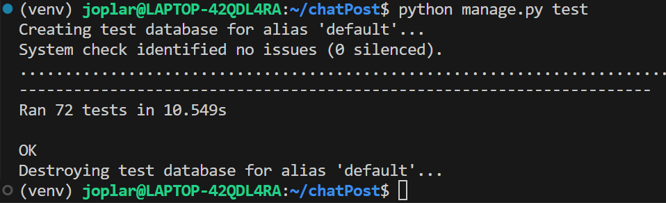
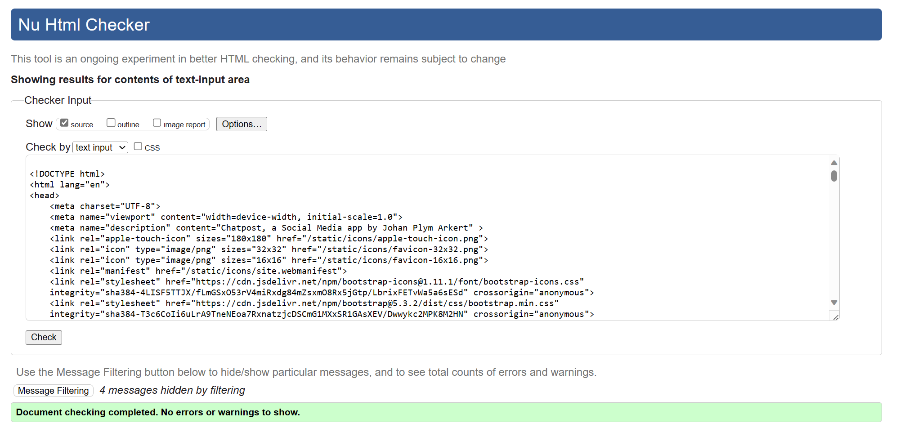
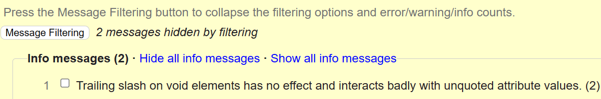
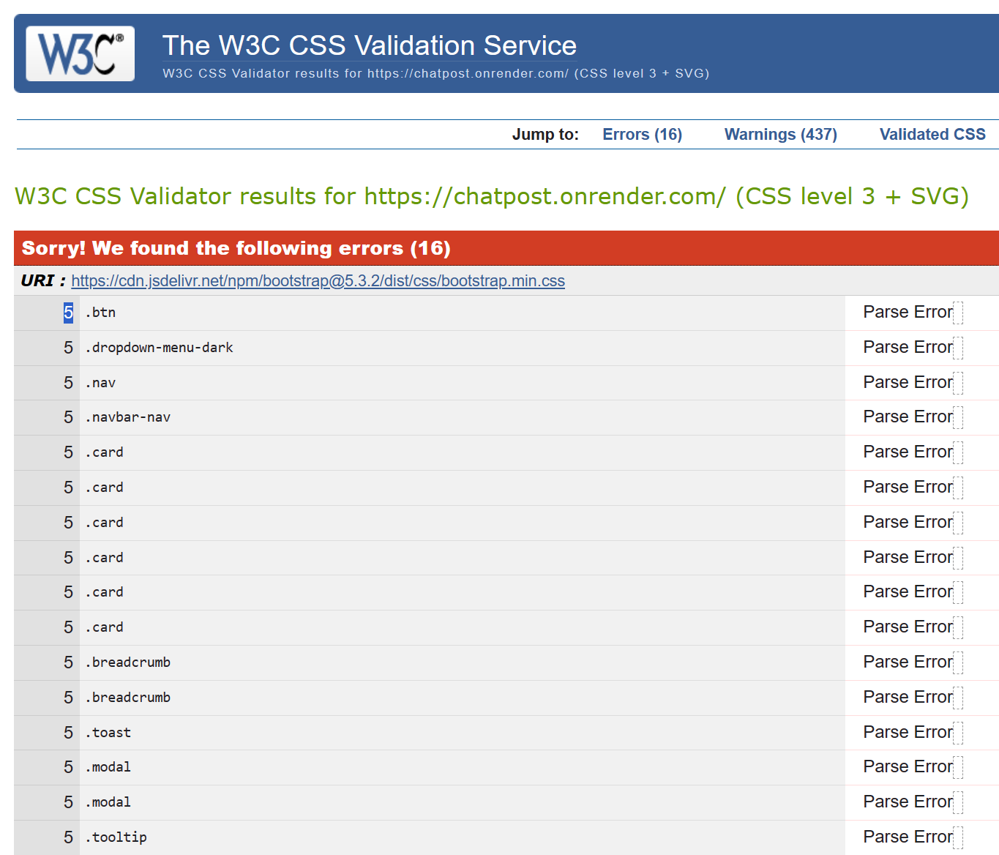

# Testing

## Manual Testing

Usability was tested with the below user acceptance testing, sent to new users to ensure testing from different users, on different devices and browsers to ensure issues were caught and where possible fixed during development.

### Positive Testing

|     | User Actions           | Expected Results | Y/N | Comments    |
|-------------|------------------------|------------------|------|-------------|
| Sign Up     |                        |                  |      |             |
| 1           | Click on Sign Up button | Redirection to Sign Up page | Y |          |
| 2           | Click on the Login link in the form | Redirection to Login page | Y |          |
| 3           | Enter valid Username | Field will only accept a unique username and will be stored in lowercase | Y |          |
| 4          | Enter valid password | Field will only accept secure passwords | Y |          |
| 5          | Enter valid password confirmation | Field will only accept the same password from the previous field | Y | |
| 6          | Click on the Sign Up button | If username and password is valid a success message displays and takes user to all rooms home page | Y |          |
| 7          | Sign In with the same email/username and password | Displays success message - Takes user to all rooms home page  | Y |      |
| 8       | Click "Logout" in the profile menu | Logs out user and redirects to All Rooms List Home Page | Y |          |
| 9          | Click browser back button | User still logged out | Y |          |
| Log In   |                        |                  |      |             |
| 1           | Click on Login button | Redirection to Login page | Y |          |
| 3           | Click on the SignUp link in the form | Redirection to SignUp page | Y |          |
| 4           | Enter username | Field takes username input| Y |          |
| 5           | Mix lowercase uppercase in Username| Login still works | Y |          |
| 6           | Enter password | Field takes username input | Y |          |
| 7           | Click on the Sign In button | If username and password is valid a success message displays and takes user to All Rooms List Home Page | Y |          |
| 8           | Click "Logout" in the navbar profile-menu | Logs out user - displays a success message - redirects to Login Page | Y |          |
| 0          | Click browser back button | User are still logged out | Y |          |
| Navbar     |                        |                  |      |             |
| 1          | Click "Logo" in the navbar | Redirects logged in user to all rooms home page | Y |          |
| 2          | Click "Login" in the navbar | Redirects user to Login/Signup page | Y |          |
| 3          | Click "Home Icon" in the navbar | Redirects logged in user to All Rooms List Home Page | Y |          |
| 4          | Click "Topics Icon" in the navbar | Displays topics menu in navbar | Y |          |
| 5          | Click "Topic List Item" in the navbar | Takes user to Topic Room List page with requested search results| Y |          |
| 6          | Click "Your Rooms Icon" in the navbar | Displays Your Rooms List Menu in Navbar | Y |          |
| 7          | Click "Your Rooms List Item" in the navbar | Takes user to room page| Y |          |
| 8          | Click "Your Rooms List Item" in the navbar | Takes user to room page| Y |          |
| 9          | Click "Friends Icon" in the navbar | Takes user Friends List Page| Y |          |
| 10          | Click "User Avatar" in the navbar | Displays Profile Menu in Navbar| Y |          |
| 11          | Click "Manage Profile" in the navbar | Redirects User to Edit Profile Page| Y |          |
| 12          | Click "View Profile" in the navbar | Redirects User to Profile Page| Y |          |
| 13          | Click "Logout" in the navbar | Logs out User - displays success message - redirects to Login Page| Y |          |
| Rooms Page    |                        |                  |      |             |
| 1          | Click "Search Rooms" Go Button | Redirects user to Search Result Rooms page | Y |          |
| 2          | Click "Create Room Button" | Redirects user to Create Room Form Page | Y |          |
| 3          | Click "Room Host Avatar or @name link" | Redirects user to Host Profile Page | Y |          |
| 4          | Click "Room Name Link" | Redirects user to Room Page | Y |          |
| 5          | Click "Edit Room Link" | Redirects user to Edit Room Page | Y |          |
| 6          | Click "Delete Room Link" | Redirects user to Confirm Delete Page | Y |          |
| Create Room Page     |                        |                  |      |             |
| 1          | Enter "Name Field" | Takes User Text input in field | Y |          |
| 2          | Select "Topic Field" | Lets User Select Rooms Topic | Y |          |
| 3          | Enter "Description Field" | Takes User Text Input in Text field | Y |          |
| 4          | Select "Access Field" | Lets User Select Public or Friends Only | Y |          |
| 5          | Click "Go Back Button" | User redirected to previous page without submitting form | Y |          |
| 6          | Click "Submit Button" | Room is created - succes message is displayed - user is redirected to new room page| Y |          |
| Room Page     |                        |                  |      |             |
| 1          | Click "Search Rooms" Go Button | Redirects user to Search Result Rooms page | Y |          |
| 2          | Click "Create Post Button" | Redirects user to Create Post Form Page | Y |          |
| 3          | Click "Host Avatar" | Redirects user to Profile Page | Y |          |
| 4          | Click "Comment Icon" | Drops down comment Form | Y |          |
| 5          | Click "Send Button" | Submits a Comment Form and reloads the page with updated comment and comment count - scrolls back to previous position | Y |          |
| 6          | Click "Like Post Icon" | Reloads page with updated Like Post Count | Y |          |
| 7          | Click "Dislike Post Icon" | Reloads page with updated Dislike Post Count | Y |          |
| 8          | Click "Like Comment Icon" | Reloads page with updated Like Comment Count | Y |          |
| 9          | Click "Dislike Comment Icon" | Reloads page with updated Dislike Comment Count | Y |          |
| Create Post Page     |                        |                  |      |             |
| 1          | Enter "Content Field" | Takes User Text input in field | Y |          |
| 2          | Click "Choose Image Button" | Lets User Select Post Image | Y |          |
| 3          | Click "Go Back Button" | User redirected to previous page without submitting form | Y |          |
| 5          | Click "Submit Button" | Submits a Post Form and redirects the user to the Room Page | Y |          |
| Friends List Page  |                        |                  |      |             |
| 1          | Click "Search Users" Go Button| Reloads page with search results | Y |          |
| 2          | Click "Avatar" in Search results| Redirects User to user profile page of clicked user| Y |          |
| 3          | Click "View Profile Button" in Friends List| Redirects User to user profile page of clicked user| Y |          |
| 4          | Click "Remove Button" in Friends List| Redirects User to the Confirm Delete Page| Y |          |
| 5          | Click "View Profile Button" in Pending List| Redirects User to user profile page of clicked user| Y |          |
| 6          | Click "Remove Button" in Pending List| Redirects User to the Confirm Delete Page| Y |          |
| Profile Page  |                        |                  |      |             |
| 1          | Click "Remove Button" | Redirects User to the Confirm Delete Page | Y |          |
| 2          | Click "Friends List Button" | Redirects User to the Friends List Page | Y |          |
| Non Friend Profile Page  |                        |                  |      |             |
| 1          | Click "Friend Request Button" | Sends a Friend Request - Request is displayed under the Pending Request List of both users - Redirects to Friendslist| Y |          |
| 2          | Click "Friends List Button" | Redirects User to the Friends List Page | Y |          |
| Confirm Delete Page  |                        |                  |      |             |
| 1          | Click "Go Back Button"| Redirects User Back to Previous Page | Y |          |
| 2          | Click "Confirm Button"| Deletes the Instance - Redirects User Back to Previous Page | Y |          |

### Negative testing
|     | User Actions           | Expected Results | Y/N | Comments    |
|-------------|------------------------|------------------|------|-------------|
| Register Page  |                        |                  |      |             |
| 1          | Blank Username| Receive form.error message | Y |          |
| 2          | Special characters in Username| Receive form.error message | Y |          |
| 3          | Already existing username| Receive form.error message | Y |          |
| 4          | Blank password| Receive form.error message | Y |          |
| 5          | Blank repeat password| Receive form.error message | Y |          |
| 6          | Non matching passwords| Receive form.error message | Y |          |
| Login Page  |                        |                  |      |             |
| 1          | Blank Username| Receive form.error message | Y |          |
| 2          | Special characters in Username| Receive form.error message | Y |          |
| 3          | Blank password| Receive form.error message | Y |          |
| 4          | Blank repeat password| Receive form.error message | Y |          |
| 5          | Non matching passwords| Receive form.error message | Y |          |
| Create/Edit Room  |                        |                  |      |             |
| 1          | Blank Name| Field Required | Y |          |
| 2          | Blank Topic| Field Required | Y |          |
| Create/Edit Post  |                        |                  |      |             |
| 1          | Blank Name| Field Required | Y |          |
| 2          | Blank Topic| Field Required | Y |          |
| 3          | Blank Content| Field Required | Y |          |
| 4          | >500 Character Text| Maxlength prohibits longer texts | Y |          |
| Comment    |                        |                  |      |             |
| 1          | Blank Content| Field Required | Y |          |
| 2          | >300 Character Text| Maxlength prohibits longer texts | Y |          |
| Edit Comment    |                        |                  |      |             |
| 1          | Blank Content| Field Required | Y |          |
| 2          | >300 Character Text| Maxlength prohibits longer texts | Y |          |
| Url-testing    |                        |                  |      |             |
| Out of bounce url:s  |                        |                  |      |             |
| 1          | Non existing "room" | Custom 404 page | Y |          |
| 2          | Non-existing "room edit" url | Custom 404 page | Y |          |
| 3          | Non-existing "post edit" url | Custom 404 page | Y |          |
| 4          | Non-existing "edit comment" url | Custom 404 page | Y |          |
| 5          | Non-existing "view-profile" url | Custom 404 page | Y |          |
| 6          | Non-existing "edit-profile" url | Custom 404 page | Y |          |
| 7          | Non-existing "remove room" url | Custom 404 page | Y |          |
| 8          | Non-existing "remove post" url | Custom 404 page | Y |          |
| 9          | Non-existing "remove comment" url | Custom 404 page | Y |          |
| 10         | Non-existing "remove friend" url | Custom 404 page | Y |          |
| Unauthorized url:s  |                        |                  |      |             |
| 1          | Non-author "room edit" url | Custom 403 page | Y |          |
| 2          | Non-author "post edit" url | Custom 403 page | Y |          |
| 3          | Non-author "edit comment" url | Custom 403 page | Y |          |
| 4          | Unauthorized "room" url" | Custom 403 page| Y |  |
| 5          | Unauthorized "remove friend" url | Custom 403 page | Y |          |
| 6          | Unauthorized "edit profile" url | Custom 403 page | Y |          |

## Automated testing

### Django unit testing

- All Urls tested for resolving correct views. 
- All views tested for correct render and redirects
- All views tested for unauthorized redirects
- All crud tested for 403 redirects

## Validation

### HTML Validation:

- HTML validation was done by using the official [W3C](https://validator.w3.org/) validator. This checking was done manually by copying the view page source code (Ctrl+U) and pasting it into the validator.

|| W3C-Tested | Errors | Warnings         | Info messages     | Comments     |
|--|------|------|-------------|--------------------|------------------------|
| Register Page | Y | 0 | 0 | "Trailing slash on void elements has no effect and interacts badly with unquoted attribute values." | Cloudinary responds with trailing slash in img elements - no solution found |
| Login Page | Y | 0 | 0 | "Trailing slash on void elements has no effect and interacts badly with unquoted attribute values." | Cloudinary responds with trailing slash in img elements - no solution found |
| Home Page | Y | 0 | 0 | "Trailing slash on void elements has no effect and interacts badly with unquoted attribute values." | Cloudinary responds with trailing slash in img elements - no solution found |
| Room Page | Y | 0 | 0 | "Trailing slash on void elements has no effect and interacts badly with unquoted attribute values." | Cloudinary responds with trailing slash in img elements - no solution found |
| Edit/Create Room | Y | 0 | 0 | "Trailing slash on void elements has no effect and interacts badly with unquoted attribute values." | Cloudinary responds with trailing slash in img elements - no solution found |
| Edit/Create Post | Y | 0 | 0  | "Trailing slash on void elements has no effect and interacts badly with unquoted attribute values." | Cloudinary responds with trailing slash in img elements - no solution found |
| Edit Comment | Y | 0 | 0 | "Trailing slash on void elements has no effect and interacts badly with unquoted attribute values." | Cloudinary responds with trailing slash in img elements - no solution found |
| Delete page | Y | 0 | 0 | "Trailing slash on void elements has no effect and interacts badly with unquoted attribute values." | Cloudinary responds with trailing slash in img elements - no solution found |

### CSS Validation:

- Some bootstrap cdn parsing errors and warnings were found when passing through the official [W3C (Jigsaw)](https://jigsaw.w3.org/css-validator/#validate_by_uri) validator. I was not able to find a solution for the parsing errors, however css code works perfectly on various devices. The warnings concern the use of css root variables and webkit css rules also from bootstraps cdn. 

### JS Validation:

- [JS Validation Report. script.js](documentation/validation/js_validation.png)

- No errors or warning messages were found when passing through the official [JSHint](https://www.jshint.com/) validator.

### Python Validation:
- [Full Python Validation Report](documentation/validation/python_validation.pdf)

---
## Lighthouse Report

- [Full Lighthouse Report](documentation/validation/lighthouse_report.pdf)

- Lighthouse report was generated for every pages, using Chrome Dev Tools.

--- 

## Compatibility

Testing was conducted on the following browsers;

- Brave;

[Compatibility Report](documentation/compatibility/compatibility_brave.png)

- Chrome;

[Compatibility Report](documentation/compatibility/compatibility_chrome.png)

- Firefox;

[Compatibility Report](documentation/compatibility/compatibility_firefox.png)

---

# Responsiveness

The responsiveness was checked manually by using devtools (Chrome) throughout the whole development. It was also checked with [Responsive Viewer](https://chrome.google.com/webstore/detail/responsive-viewer/inmopeiepgfljkpkidclfgbgbmfcennb/related?hl=en) Chrome extension.

[Responsiveness Report](documentation/responsiveness/responsiveness.pdf)

---

## Bugs

### Solved bugs

### Known bugs

